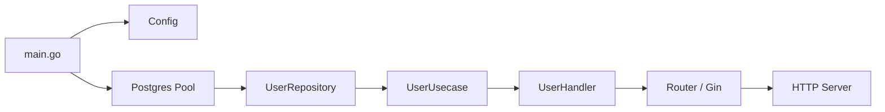
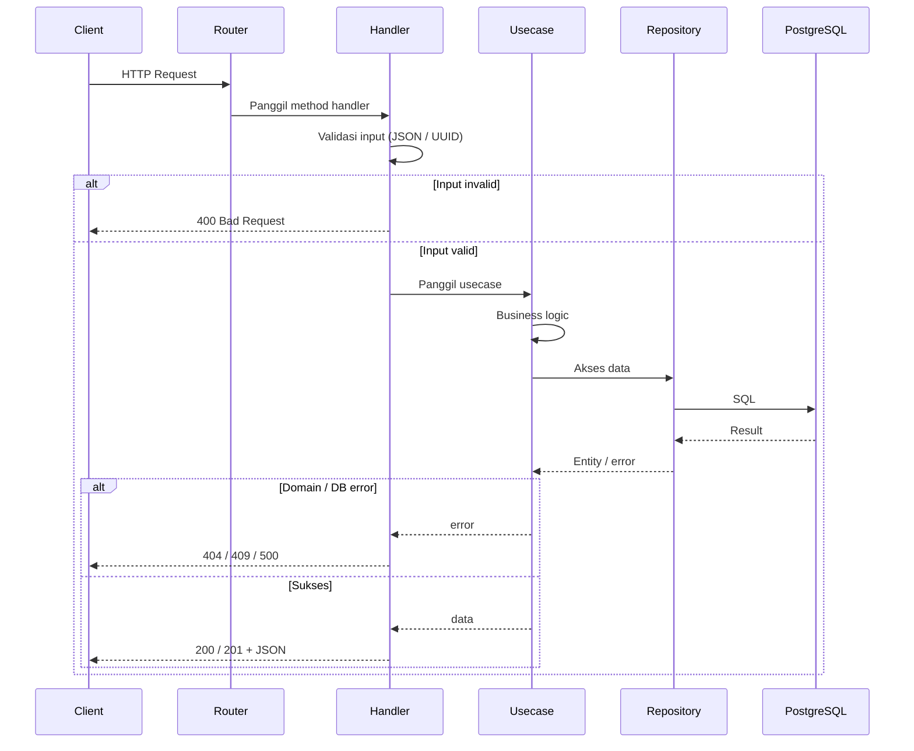
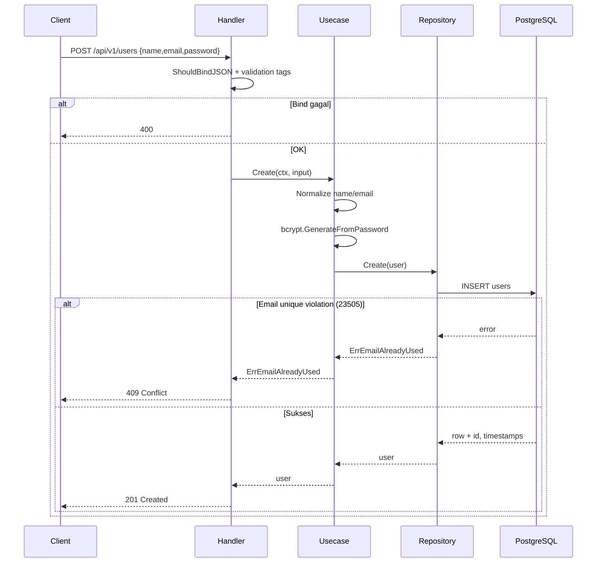
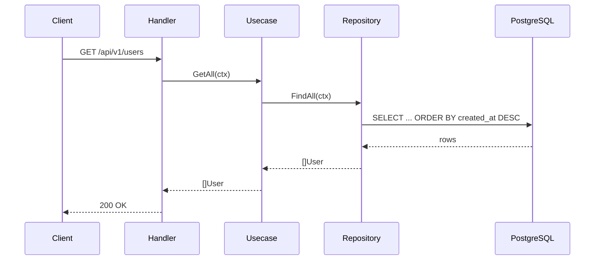
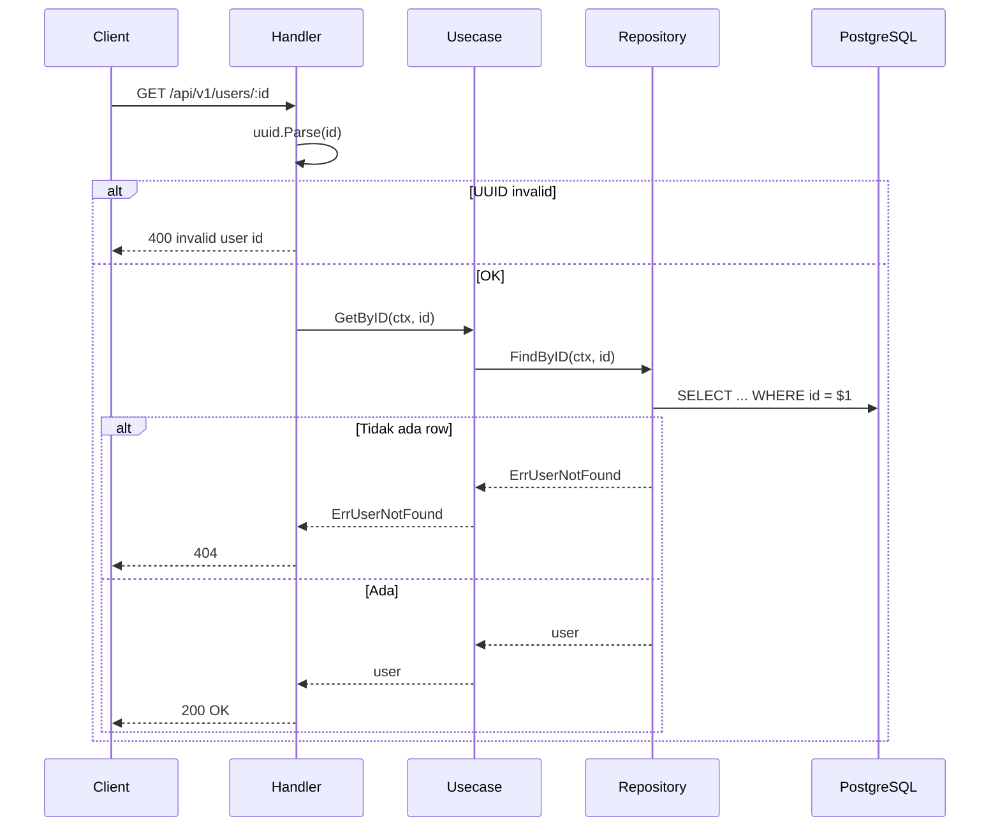
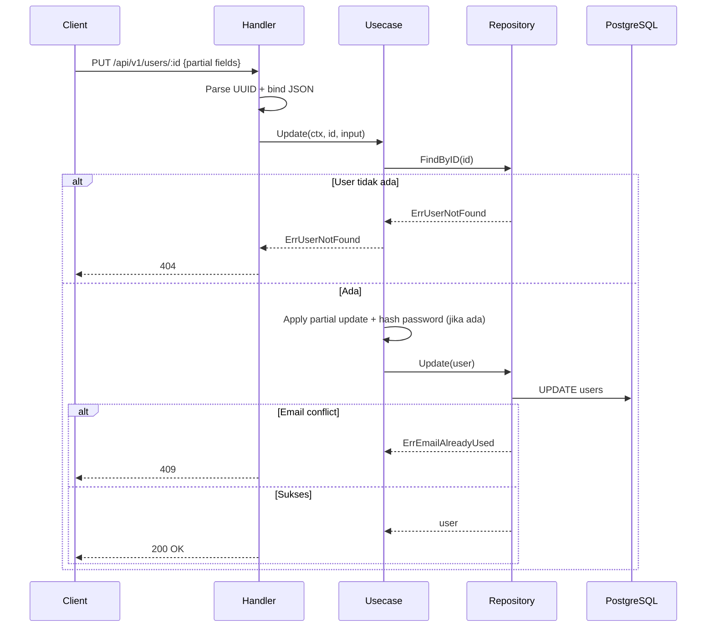
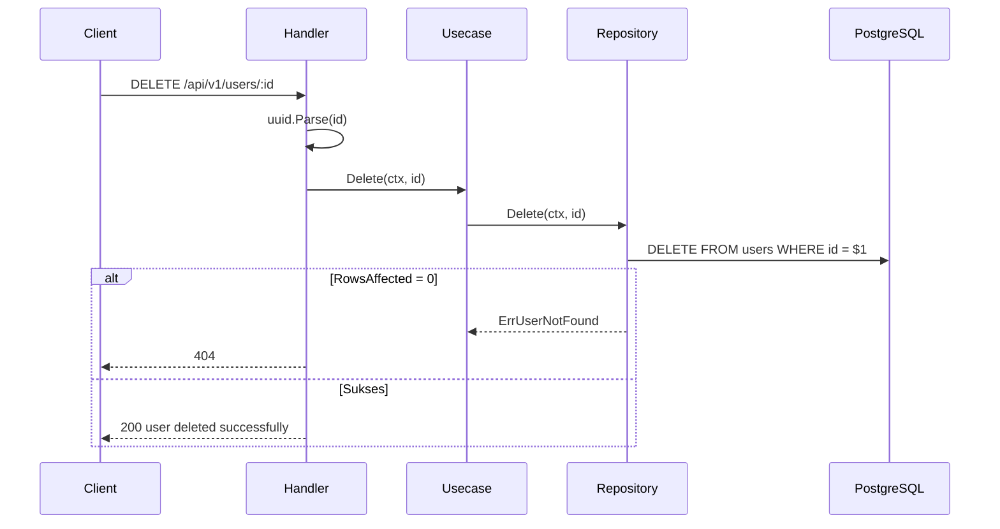

# Alur Proses Project / Process Flow

Dokumentasi alur proses arsitektur dan case **CRUD Users**.

This document explains the architecture wiring and the **Users CRUD** request flow.

---

## 1. Arsitektur Layer / Architecture Layers

```text
Client (HTTP)
    ↓
Router          →  memetakan URL ke handler
Handler         →  validasi request HTTP, response JSON
Usecase         →  business logic (hash password, normalisasi data)
Repository      →  query SQL ke database
PostgreSQL      →  penyimpanan data
```

| Layer | Package | Tanggung jawab / Responsibility |
|-------|---------|---------------------------------|
| Router | `internal/router` | Bind HTTP method + path ke handler |
| Handler | `internal/handler` | Parse JSON/path, panggil usecase, map error → status code |
| Usecase | `internal/usecase` | Aturan bisnis, bcrypt password |
| Repository | `internal/repository` | SQL via `pgx` |
| Domain | `internal/domain` | Entity, DTO, interface, error domain |

### Dependency injection saat startup

Di `cmd/api/main.go`:

```text
config.Load()
    → database.NewPostgresPool()
    → repository.NewUserRepository(db)
    → usecase.NewUserUsecase(userRepo)
    → handler.NewUserHandler(userUsecase)
    → router.New(userHandler)
    → http.Server.ListenAndServe()
```



---

## 2. Endpoint Users

| Method | Path | Handler | Usecase | Repository |
|--------|------|---------|---------|------------|
| `POST` | `/api/v1/users` | `Create` | `Create` | `Create` |
| `GET` | `/api/v1/users` | `GetAll` | `GetAll` | `FindAll` |
| `GET` | `/api/v1/users/:id` | `GetByID` | `GetByID` | `FindByID` |
| `PUT` | `/api/v1/users/:id` | `Update` | `Update` | `FindByID` + `Update` |
| `DELETE` | `/api/v1/users/:id` | `Delete` | `Delete` | `Delete` |

---

## 3. Alur Umum Request / Common Request Flow



---

## 4. Create User (`POST /api/v1/users`)

### Langkah

1. **Handler** — bind JSON ke `CreateUserInput` (`name`, `email`, `password`)
2. **Usecase** — trim name, lowercase email, validasi kosong, hash password (bcrypt)
3. **Repository** — `INSERT INTO users ... RETURNING ...`
4. **Handler** — response `201` + data user (password tidak ikut JSON, tag `json:"-"`)

### Sequence



### Contoh request / response

```bash
curl -X POST http://localhost:8080/api/v1/users \
  -H "Content-Type: application/json" \
  -d '{"name":"Irul","email":"irul@example.com","password":"secret123"}'
```

```json
{
  "success": true,
  "message": "user created successfully",
  "data": {
    "id": "f6f794d1-ac0a-40c7-8227-275498c38b99",
    "name": "Irul",
    "email": "irul@example.com",
    "created_at": "2026-07-15T10:31:35.587812+07:00",
    "updated_at": "2026-07-15T10:31:35.587812+07:00"
  }
}
```

---

## 5. List Users (`GET /api/v1/users`)



---

## 6. Get User by ID (`GET /api/v1/users/:id`)



---

## 7. Update User (`PUT /api/v1/users/:id`)

### Langkah

1. **Handler** — parse UUID + bind `UpdateUserInput` (field opsional: `name`, `email`, `password`)
2. **Usecase** — `FindByID` dulu; update field yang dikirim; hash password jika ada
3. **Repository** — `UPDATE users SET ... WHERE id = $4 RETURNING ...`



---

## 8. Delete User (`DELETE /api/v1/users/:id`)



> Catatan: tabel `notes` punya FK `user_id` dengan `ON DELETE CASCADE`, jadi note milik user ikut terhapus di level database.

---

## 9. Mapping Error → HTTP Status

| Domain error | HTTP | Pesan tipikal |
|--------------|------|---------------|
| Validasi Gin / UUID invalid | `400` | bind error / `invalid user id` |
| `ErrInvalidUserInput` | `400` | `invalid user input` |
| `ErrUserNotFound` | `404` | `user not found` |
| `ErrEmailAlreadyUsed` | `409` | `email already used` |
| Error lain | `500` | `internal server error` |

Logic ada di `UserHandler.handleError`.

---

## 10. Format Response Standar

Sukses:

```json
{
  "success": true,
  "message": "...",
  "data": {}
}
```

Gagal:

```json
{
  "success": false,
  "message": "..."
}
```

Helper: `internal/handler/response.go`

---

## 11. File terkait / Related files

| File | Peran |
|------|-------|
| `cmd/api/main.go` | Wiring dependency + graceful shutdown |
| `internal/router/router.go` | Route registration |
| `internal/handler/user_handler.go` | HTTP layer |
| `internal/usecase/user_usecase.go` | Business logic |
| `internal/repository/user_repository.go` | SQL |
| `internal/domain/user.go` | Entity, DTO, interface |
| `migrations/00001_create_users_table.sql` | Schema `users` |

---

## 12. Ringkasan satu layar / One-page summary

```text
POST/GET/PUT/DELETE /api/v1/users[/:id]
        │
        ▼
   ┌─────────┐
   │ Handler │  validasi HTTP, response JSON
   └────┬────┘
        ▼
   ┌─────────┐
   │ Usecase │  normalize, bcrypt, aturan bisnis
   └────┬────┘
        ▼
   ┌────────────┐
   │ Repository │  INSERT / SELECT / UPDATE / DELETE
   └─────┬──────┘
         ▼
    PostgreSQL (users)
```
