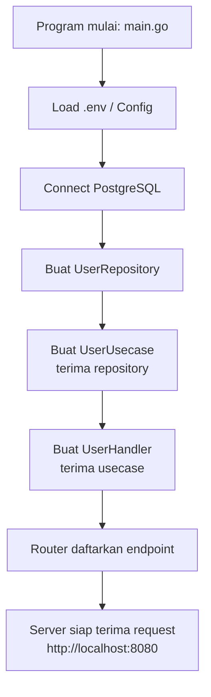
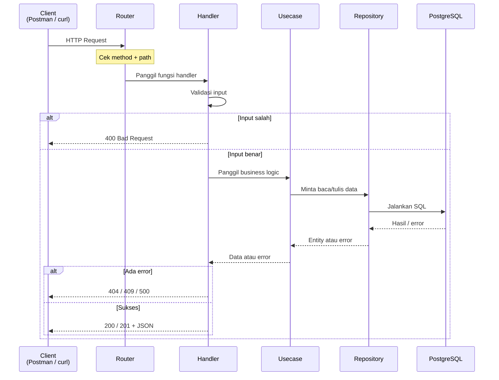
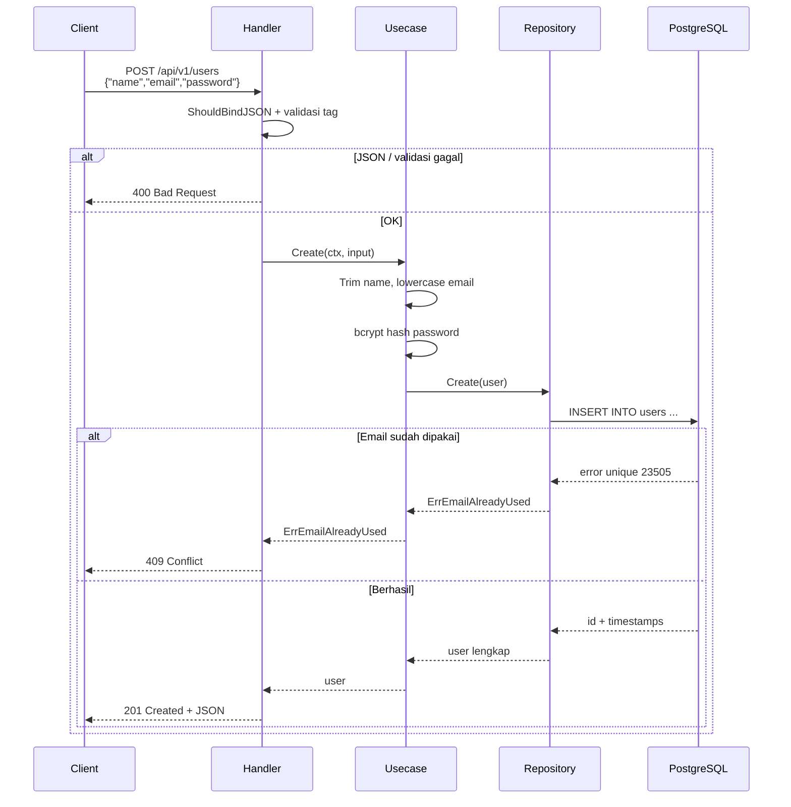
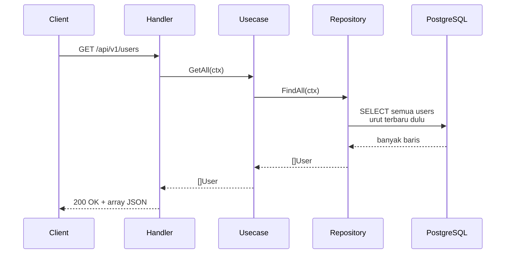
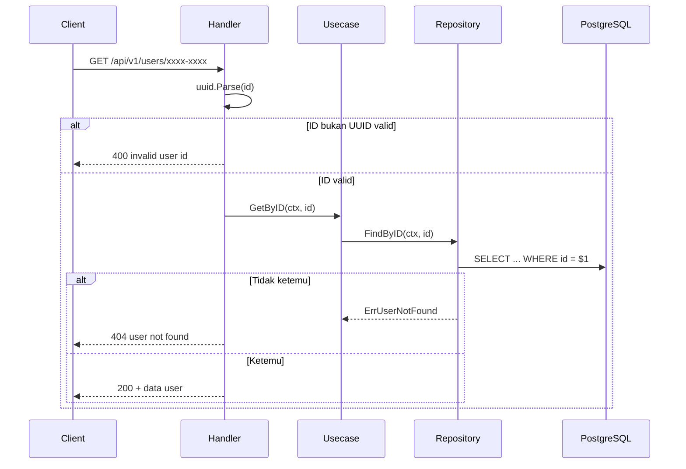
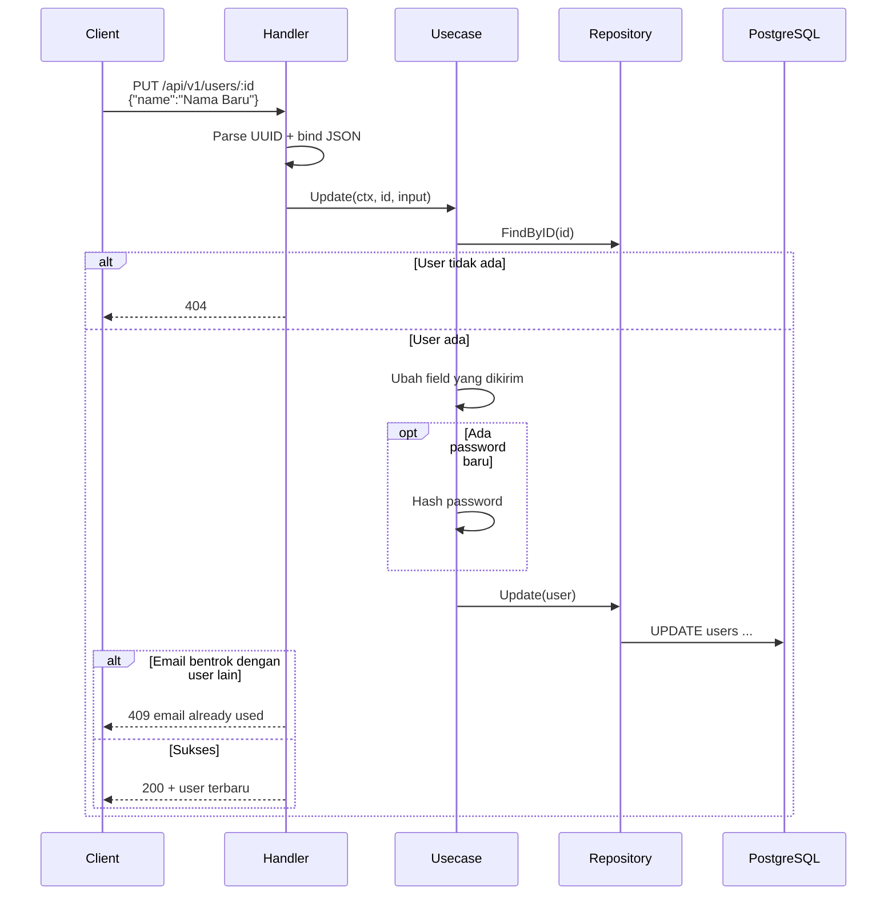
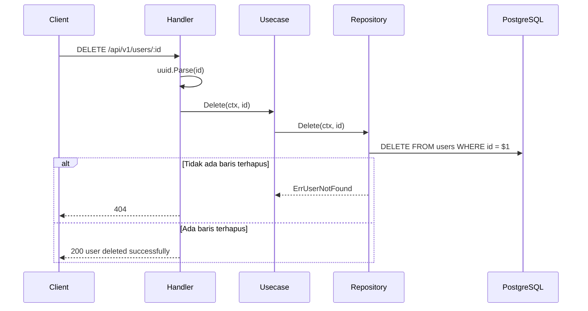

# Alur Proses Project (Panduan Pemula)

Dokumen ini menjelaskan **cara kerja API Users** dari request masuk sampai data tersimpan di database.

Ditulis untuk pemula: istilah teknis dijelaskan dulu, lalu alur step-by-step.

**English readers:** technical terms are kept in English (as in the code). Flow explanations are in Bahasa Indonesia.

---

## Daftar Isi

1. [Istilah penting (glossary)](#1-istilah-penting-glossary)
2. [Apa itu CRUD?](#2-apa-itu-crud)
3. [Kenapa kodenya dipisah per layer?](#3-kenapa-kodenya-dipisah-per-layer)
4. [Analogi restoran](#4-analogi-restoran)
5. [Apa yang terjadi saat server dinyalakan?](#5-apa-yang-terjadi-saat-server-dinyalakan)
6. [Struktur tabel `users`](#6-struktur-tabel-users)
7. [Alur umum setiap request](#7-alur-umum-setiap-request)
8. [Create user (membuat)](#8-create-user-membuat)
9. [List users (melihat semua)](#9-list-users-melihat-semua)
10. [Get user by ID (melihat satu)](#10-get-user-by-id-melihat-satu)
11. [Update user (mengubah)](#11-update-user-mengubah)
12. [Delete user (menghapus)](#12-delete-user-menghapus)
13. [Error & HTTP status code](#13-error--http-status-code)
14. [Format response JSON](#14-format-response-json)
15. [Cara membaca kode (urutan belajar)](#15-cara-membaca-kode-urutan-belajar)
16. [File terkait](#16-file-terkait)
17. [Ringkasan satu layar](#17-ringkasan-satu-layar)

---

## 1. Istilah penting (glossary)


| Istilah                  | Arti sederhana                                                                      |
| ------------------------ | ----------------------------------------------------------------------------------- |
| **API**                  | Pintu komunikasi. Client (Postman/curl/frontend) mengirim request, server membalas  |
| **HTTP**                 | Protokol request/response di web (`GET`, `POST`, `PUT`, `DELETE`)                   |
| **Endpoint**             | Alamat URL + method, contoh: `POST /api/v1/users`                                   |
| **JSON**                 | Format data teks yang umum dipakai API, contoh: `{"name":"Irul"}`                   |
| **Client**               | Yang mengirim request (browser, Postman, mobile app, `curl`)                        |
| **Server**               | Program Go kita yang menerima request dan membalas                                  |
| **Database**             | Tempat menyimpan data secara permanen (di project ini: PostgreSQL)                  |
| **Migration**            | File SQL untuk membuat/mengubah struktur tabel                                      |
| **CRUD**                 | Create, Read, Update, Delete — operasi dasar data                                   |
| **UUID**                 | ID unik panjang, contoh: `f6f794d1-ac0a-40c7-8227-275498c38b99`                     |
| **Hash password**        | Password diubah jadi teks acak (bcrypt) supaya tidak disimpan plain text            |
| **Layer**                | Lapisan kode dengan tugas berbeda (handler, usecase, repository)                    |
| **Interface**            | “Kontrak” di Go: mendefinisikan method yang harus ada, tanpa peduli implementasinya |
| **Dependency Injection** | Menyambungkan bagian-bagian (repo → usecase → handler) di `main.go`                 |


---

## 2. Apa itu CRUD?

CRUD adalah 4 operasi dasar terhadap data:


| Huruf      | Arti              | HTTP Method | Contoh di project            |
| ---------- | ----------------- | ----------- | ---------------------------- |
| **C**reate | Membuat data baru | `POST`      | Buat user baru               |
| **R**ead   | Membaca data      | `GET`       | Lihat semua user / satu user |
| **U**pdate | Mengubah data     | `PUT`       | Ubah nama/email/password     |
| **D**elete | Menghapus data    | `DELETE`    | Hapus user                   |


---

## 3. Kenapa kodenya dipisah per layer?

Kalau semua logic ditulis di satu file, project cepat berantakan.

Di project ini dipakai pola:

```text
Router → Handler → Usecase → Repository → Database
```


| Layer          | Folder                | Tugas (bahasa manusia)                          | Boleh berisi SQL? |
| -------------- | --------------------- | ----------------------------------------------- | ----------------- |
| **Router**     | `internal/router`     | “Kalau URL ini dipanggil, pakai fungsi ini”     | Tidak             |
| **Handler**    | `internal/handler`    | Terima request HTTP, cek format, kirim response | Tidak             |
| **Usecase**    | `internal/usecase`    | Aturan bisnis (hash password, rapikan email)    | Tidak             |
| **Repository** | `internal/repository` | Bicara ke database (SQL)                        | Ya                |
| **Domain**     | `internal/domain`     | Bentuk data + aturan error bersama              | Tidak             |


**Manfaat untuk pemula:**

- Mau ubah SQL? Cukup buka `repository`
- Mau ubah aturan bisnis? Cukup buka `usecase`
- Mau ubah format response HTTP? Cukup buka `handler`

---

## 4. Analogi restoran

Bayangkan API seperti restoran:


| Bagian restoran           | Layer di project | Peran                                                            |
| ------------------------- | ---------------- | ---------------------------------------------------------------- |
| Pintu masuk / daftar menu | **Router**       | Menentukan pesanan masuk ke pelayan mana                         |
| Pelayan                   | **Handler**      | Terima pesanan dari customer, cek pesanan lengkap, antar makanan |
| Koki                      | **Usecase**      | Memasak / menerapkan aturan (resep)                              |
| Gudang bahan              | **Repository**   | Ambil/simpan bahan di gudang                                     |
| Gudang fisik              | **PostgreSQL**   | Tempat bahan benar-benar disimpan                                |


Customer (client) **tidak** langsung masuk ke gudang.  
Begitu juga: request HTTP **tidak** langsung menulis SQL di handler.

---

## 5. Apa yang terjadi saat server dinyalakan?

Saat kamu menjalankan `make run` atau `make docker-up`, `cmd/api/main.go` melakukan ini **berurutan**:

```text
1. Baca file .env          → config.Load()
2. Koneksi ke PostgreSQL   → database.NewPostgresPool()
3. Buat Repository         → NewUserRepository(db)
4. Buat Usecase            → NewUserUsecase(userRepo)
5. Buat Handler            → NewUserHandler(userUsecase)
6. Daftarkan route         → router.New(userHandler)
7. Nyalakan HTTP server    → ListenAndServe() di port 8080
```




**Arti dependency injection (sederhana):**

- Handler **butuh** usecase → diberikan di `main.go`
- Usecase **butuh** repository → diberikan di `main.go`
- Repository **butuh** koneksi DB → diberikan di `main.go`

Jadi tiap bagian tidak membuat dependency-nya sendiri; semuanya disambungkan di satu tempat.

---

## 6. Struktur tabel `users`

Dari migration `migrations/00001_create_users_table.sql`:


| Kolom        | Tipe         | Keterangan                                 |
| ------------ | ------------ | ------------------------------------------ |
| `id`         | UUID         | Primary key, dibuat otomatis oleh database |
| `name`       | VARCHAR(255) | Nama user, wajib                           |
| `email`      | VARCHAR(255) | Email, wajib, **harus unik**               |
| `password`   | VARCHAR(255) | Password yang sudah di-hash, wajib         |
| `created_at` | TIMESTAMPTZ  | Waktu dibuat                               |
| `updated_at` | TIMESTAMPTZ  | Waktu terakhir diubah                      |


**Penting:**

- Email unik → tidak boleh dua user dengan email sama
- Password di database **bukan** teks asli, tapi hasil bcrypt
- Di response JSON, field password **sengaja disembunyikan** (`json:"-"` di domain)

---

## 7. Alur umum setiap request

Setiap request CRUD hampir selalu mengikuti pola yang sama:

```text
1. Client kirim HTTP request
2. Router pilih handler yang cocok
3. Handler cek input (JSON / UUID)
4. Handler panggil usecase
5. Usecase jalankan aturan bisnis
6. Usecase panggil repository
7. Repository jalankan SQL
8. Hasil kembali ke atas: Repo → Usecase → Handler → Client (JSON)
```




### Endpoint Users


| Method   | Path                | Artinya                     |
| -------- | ------------------- | --------------------------- |
| `POST`   | `/api/v1/users`     | Buat user baru              |
| `GET`    | `/api/v1/users`     | Ambil semua user            |
| `GET`    | `/api/v1/users/:id` | Ambil 1 user berdasarkan ID |
| `PUT`    | `/api/v1/users/:id` | Ubah data user              |
| `DELETE` | `/api/v1/users/:id` | Hapus user                  |


`:id` artinya bagian URL yang diganti, contoh:

```text
GET /api/v1/users/f6f794d1-ac0a-40c7-8227-275498c38b99
```

---

## 8. Create User (membuat)

**Tujuan:** menyimpan user baru ke database.

**Endpoint:** `POST /api/v1/users`

### Step-by-step (detail)


| No  | Layer      | Apa yang dilakukan                                                                     | File                                     |
| --- | ---------- | -------------------------------------------------------------------------------------- | ---------------------------------------- |
| 1   | Router     | Meneruskan `POST /api/v1/users` ke `UserHandler.Create`                                | `internal/router/router.go`              |
| 2   | Handler    | Membaca body JSON → struct `CreateUserInput`                                           | `internal/handler/user_handler.go`       |
| 3   | Handler    | Validasi otomatis (Gin): `name` wajib, `email` format email, `password` min 6 karakter | `internal/domain/user.go`                |
| 4   | Usecase    | Rapikan data: trim spasi nama, email jadi huruf kecil                                  | `internal/usecase/user_usecase.go`       |
| 5   | Usecase    | Hash password dengan **bcrypt** (jangan simpan password mentah)                        | sama                                     |
| 6   | Repository | `INSERT INTO users (name, email, password) ...`                                        | `internal/repository/user_repository.go` |
| 7   | Database   | Simpan row baru, generate `id`, `created_at`, `updated_at`                             | PostgreSQL                               |
| 8   | Handler    | Balas `201 Created` + data user (tanpa password)                                       | `user_handler.go`                        |


### Sequence diagram




### Contoh request

```bash
curl -X POST http://localhost:8080/api/v1/users \
  -H "Content-Type: application/json" \
  -d '{
    "name": "Irul",
    "email": "irul@example.com",
    "password": "secret123"
  }'
```

### Contoh response sukses (`201`)

```json
{
  "success": true,
  "message": "user created successfully",
  "data": {
    "id": "f6f794d1-ac0a-40c7-8227-275498c38b99",
    "name": "Irul",
    "email": "irul@example.com",
    "created_at": "2026-07-15T10:31:35.587812+07:00",
    "updated_at": "2026-07-15T10:31:35.587812+07:00"
  }
}
```

Perhatikan: **tidak ada field `password`** di response. Itu disengaja demi keamanan.

### Contoh response gagal — email sudah ada (`409`)

```json
{
  "success": false,
  "message": "email already used"
}
```

### Tips pemula

- Kalau Create gagal validasi, biasanya masalah di body JSON (field kurang / format email salah / password terlalu pendek).
- Error `409` berarti email sudah terdaftar — coba email lain.

---

## 9. List Users (melihat semua)

**Tujuan:** mengambil daftar semua user.

**Endpoint:** `GET /api/v1/users`

### Step-by-step


| No  | Layer      | Apa yang dilakukan                               |
| --- | ---------- | ------------------------------------------------ |
| 1   | Handler    | Tidak perlu body JSON                            |
| 2   | Usecase    | Langsung teruskan ke repository (`GetAll`)       |
| 3   | Repository | `SELECT ... FROM users ORDER BY created_at DESC` |
| 4   | Handler    | Balas `200` + array user                         |





### Contoh request

```bash
curl http://localhost:8080/api/v1/users
```

### Contoh response

```json
{
  "success": true,
  "message": "users fetched successfully",
  "data": [
    {
      "id": "f6f794d1-ac0a-40c7-8227-275498c38b99",
      "name": "Irul",
      "email": "irul@example.com",
      "created_at": "2026-07-15T10:31:35.587812+07:00",
      "updated_at": "2026-07-15T10:31:35.587812+07:00"
    }
  ]
}
```

Kalau belum ada user, `data` bisa berupa array kosong: `[]`.

---

## 10. Get User by ID (melihat satu)

**Tujuan:** ambil data 1 user berdasarkan ID.

**Endpoint:** `GET /api/v1/users/:id`

### Step-by-step


| No  | Layer          | Apa yang dilakukan                        |
| --- | -------------- | ----------------------------------------- |
| 1   | Handler        | Ambil `:id` dari URL                      |
| 2   | Handler        | Cek apakah string itu UUID valid          |
| 3   | Usecase / Repo | Cari user di DB dengan `WHERE id = $1`    |
| 4   | Handler        | Kalau ketemu → `200`, kalau tidak → `404` |





### Contoh request

```bash
curl http://localhost:8080/api/v1/users/f6f794d1-ac0a-40c7-8227-275498c38b99
```

### Tips pemula

- Kalau dapat `400 invalid user id`, biasanya ID di URL rusak / bukan format UUID.
- Kalau dapat `404`, UUID-nya valid tapi user memang tidak ada di database.

---

## 11. Update User (mengubah)

**Tujuan:** mengubah sebagian/semua data user yang sudah ada.

**Endpoint:** `PUT /api/v1/users/:id`

Field body **opsional** (`name`, `email`, `password`). Kirim hanya yang ingin diubah.

### Step-by-step


| No  | Layer      | Apa yang dilakukan                    |
| --- | ---------- | ------------------------------------- |
| 1   | Handler    | Parse UUID dari URL                   |
| 2   | Handler    | Bind JSON ke `UpdateUserInput`        |
| 3   | Usecase    | Ambil user lama dulu (`FindByID`)     |
| 4   | Usecase    | Timpa field yang dikirim client       |
| 5   | Usecase    | Jika ada password baru → hash lagi    |
| 6   | Repository | `UPDATE users SET ... WHERE id = ...` |
| 7   | Handler    | Balas `200` + data terbaru            |





### Contoh request

```bash
curl -X PUT http://localhost:8080/api/v1/users/f6f794d1-ac0a-40c7-8227-275498c38b99 \
  -H "Content-Type: application/json" \
  -d '{
    "name": "Irul Updated"
  }'
```

### Tips pemula

- Update **bukan** selalu mengganti semua kolom. Di project ini dipakai partial update (hanya field yang dikirim).
- `updated_at` diisi ulang oleh database (`NOW()`).

---

## 12. Delete User (menghapus)

**Tujuan:** menghapus user dari database.

**Endpoint:** `DELETE /api/v1/users/:id`

### Step-by-step


| No  | Layer      | Apa yang dilakukan                                |
| --- | ---------- | ------------------------------------------------- |
| 1   | Handler    | Parse UUID                                        |
| 2   | Usecase    | Panggil `Delete`                                  |
| 3   | Repository | `DELETE FROM users WHERE id = $1`                 |
| 4   | Repository | Jika tidak ada baris terhapus → `ErrUserNotFound` |
| 5   | Handler    | `200` jika sukses, `404` jika tidak ketemu        |





### Contoh request

```bash
curl -X DELETE http://localhost:8080/api/v1/users/f6f794d1-ac0a-40c7-8227-275498c38b99
```

### Catatan penting (relasi `notes`)

Tabel `notes` punya kolom `user_id` yang mengarah ke `users.id` dengan aturan:

```text
ON DELETE CASCADE
```

Artinya: kalau user dihapus, **semua note milik user itu ikut terhapus otomatis** oleh database.

---

## 13. Error & HTTP status code

HTTP status adalah angka yang menjelaskan hasil request.


| Kode  | Arti umum             | Kapan muncul di project ini                 |
| ----- | --------------------- | ------------------------------------------- |
| `200` | OK                    | Read / Update / Delete sukses               |
| `201` | Created               | Create user sukses                          |
| `400` | Bad Request           | JSON salah, UUID invalid, input tidak valid |
| `404` | Not Found             | User tidak ditemukan                        |
| `409` | Conflict              | Email sudah dipakai                         |
| `500` | Internal Server Error | Error tak terduga (misalnya DB down)        |


### Mapping error di kode

Fungsi `handleError` di `user_handler.go` mengubah error domain menjadi status HTTP:


| Error di kode               | HTTP  |
| --------------------------- | ----- |
| Validasi Gin / UUID invalid | `400` |
| `ErrInvalidUserInput`       | `400` |
| `ErrUserNotFound`           | `404` |
| `ErrEmailAlreadyUsed`       | `409` |
| error lain                  | `500` |


Definisi error ada di `internal/domain/user.go`.

---

## 14. Format response JSON

Semua response dibuat seragam lewat `internal/handler/response.go`.

### Sukses

```json
{
  "success": true,
  "message": "pesan sukses",
  "data": {}
}
```

### Gagal

```json
{
  "success": false,
  "message": "pesan error"
}
```

`data` bisa:

- 1 object user
- array users
- tidak ada (misalnya setelah delete)

---

## 15. Cara membaca kode (urutan belajar)

Kalau kamu pemula, baca file dengan urutan ini:

```text
1. migrations/00001_create_users_table.sql
   → paham dulu bentuk tabel users

2. internal/domain/user.go
   → paham bentuk data + error

3. internal/router/router.go
   → lihat endpoint apa saja

4. internal/handler/user_handler.go
   → lihat request masuk & response keluar

5. internal/usecase/user_usecase.go
   → lihat aturan bisnis + bcrypt

6. internal/repository/user_repository.go
   → lihat SQL-nya

7. cmd/api/main.go
   → lihat bagaimana semua bagian disambungkan
```

### Latihan pemahaman

Coba jawab sendiri:

1. Saat Create, siapa yang hash password — handler atau usecase?
2. Kenapa password tidak muncul di JSON response?
3. Apa bedanya error `400` dan `404` pada Get by ID?
4. Kenapa Update harus `FindByID` dulu sebelum menulis ke DB?

Jawaban singkat:

1. **Usecase**
2. Karena tag `json:"-"` di field `Password`
3. `400` = format ID salah; `404` = ID benar tapi data tidak ada
4. Supaya tahu data lama, lalu menimpa hanya field yang dikirim client

---

## 16. File terkait


| File                                      | Peran untuk pemula                           |
| ----------------------------------------- | -------------------------------------------- |
| `cmd/api/main.go`                         | Titik mulai program + sambungkan semua layer |
| `internal/config/config.go`               | Baca setting dari `.env`                     |
| `internal/database/postgres.go`           | Buat koneksi ke PostgreSQL                   |
| `internal/router/router.go`               | Daftar URL/endpoint                          |
| `internal/handler/user_handler.go`        | Pintu masuk HTTP untuk users                 |
| `internal/handler/response.go`            | Template JSON sukses/gagal                   |
| `internal/usecase/user_usecase.go`        | Aturan bisnis users                          |
| `internal/repository/user_repository.go`  | SQL users                                    |
| `internal/domain/user.go`                 | Model data + interface + error               |
| `migrations/00001_create_users_table.sql` | Membuat tabel `users`                        |
| `migrations/00002_create_notes_table.sql` | Membuat tabel `notes` (relasi ke users)      |


---

## 17. Ringkasan satu layar

```text
Client (curl / Postman / frontend)
        │
        │  HTTP JSON
        ▼
   ┌─────────┐
   │ Router  │  pilih handler berdasarkan method + path
   └────┬────┘
        ▼
   ┌─────────┐
   │ Handler │  validasi request, bentuk response JSON
   └────┬────┘
        ▼
   ┌─────────┐
   │ Usecase │  aturan bisnis + hash password
   └────┬────┘
        ▼
   ┌────────────┐
   │ Repository │  jalankan SQL
   └─────┬──────┘
         ▼
    PostgreSQL
    tabel: users
```

**CRUD Users singkat:**


| Aksi     | Method + Path              | Inti proses                         |
| -------- | -------------------------- | ----------------------------------- |
| Create   | `POST /api/v1/users`       | Validasi → hash password → `INSERT` |
| Read all | `GET /api/v1/users`        | `SELECT` semua                      |
| Read one | `GET /api/v1/users/:id`    | Parse UUID → `SELECT` satu          |
| Update   | `PUT /api/v1/users/:id`    | Cari dulu → ubah field → `UPDATE`   |
| Delete   | `DELETE /api/v1/users/:id` | Parse UUID → `DELETE`               |


Kalau masih bingung satu bagian, mulai dari **Create User** saja: ikuti diagram + buka 3 file `handler` → `usecase` → `repository` sambil baca baris demi baris.